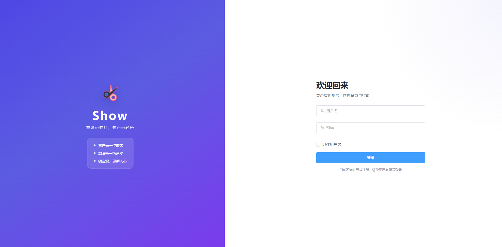
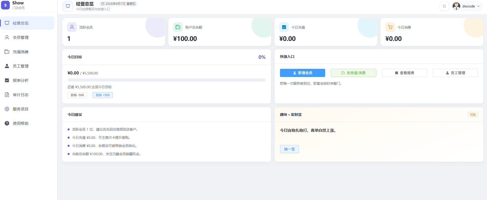
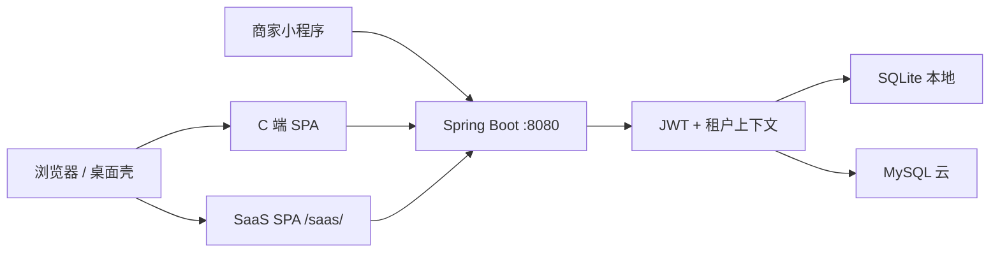

# Show · 理发店会员管理系统

面向中小理发店、社区店、夫妻店的轻量会员与收银系统。  
支持 **本地买断（SQLite）** 与 **SaaS 云版（MySQL）** 双轨交付，并可选 **商家微信小程序**、**SaaS 运营台**、**Windows 桌面安装包**。


---

## 产品一览

| 形态 | 数据 | 适合谁 | 入口 |
|------|------|--------|------|
| **本地买断版** | 本机 SQLite（`~/.show/show.db`） | 单店、可离线 | `http://localhost:8080` · 或 MSI 桌面客户端 |
| **SaaS 云版** | 云端 MySQL | 多店、运营开店、小程序 | 同端口 C 端 + `/saas/` 运营台 |

安装向导（`/#/setup`）可选择「本地买断」或「SaaS 云版」并写入 `~/.show/install.properties`。

---

## 功能简介

### 1. 门店 C 端（收银系统）

| 模块 | 说明 |
|------|------|
| **登录 / 注册** | 店长注册登录；策略 `first-only` / `open` / `invite`；改密、JWT |
| **安装向导** | 首次选型本地 SQLite 或 SaaS MySQL |
| **经营总览** | 会员数、余额、今日充值/消费、今日目标、快捷入口 |
| **会员管理** | 增改、手机号唯一、4 位校验码、停用恢复、余额展示、CSV 导出 |
| **充值 / 消费** | 充值入账；消费选员工+服务+校验码；余额原子扣减；流水查询与导出 |
| **冲正** | 充值/消费冲正（需权限） |
| **员工管理** | 在岗员工增改、启停；参与消费分派 |
| **服务项目** | 服务名称与默认价；消费金额可联动默认价 |
| **店员账号** | 店长 / 收银员 / 店员多角色；菜单与接口权限 fail-closed |
| **报表** | 区间汇总、服务分布、员工业绩及导出 |
| **审计日志** | 关键业务操作可检索 |
| **门店资料** | 店名、套餐配额展示（云版） |
| **租户设置** | 如今日目标 `dailyTarget`（白名单校验） |
| **备份恢复** | SQLite 整库备份列表/下载；恢复排队后重启生效（云版请用 mysqldump） |
| **使用帮助** | 本机访问地址、注意事项 |

### 2. SaaS 运营台（`/saas/`）

| 模块 | 说明 |
|------|------|
| **运营登录** | 平台账号（与 C 端 Token 隔离） |
| **驾驶舱** | 全网租户与经营概览 |
| **租户管理** | 启停、套餐/配额、标签备注、只读模式、续期账单、重置店长密码 |
| **邀请码** | 生成/吊销；商家凭码开店 |
| **公开开店** | `/saas/#/open-shop` 邀请码 + 店长账号开通门店 |
| **套餐目录** | free / plus / pro 等 |
| **公告** | 全网或指定门店公告 |
| **审计 / 账单** | 平台侧操作与续期记录 |

C 端 API：`/api/**` · SaaS API：`/api/saas/**` · 鉴权互斥。

### 3. 商家微信小程序（`miniprogram-biz/`）

| 模块 | 说明 |
|------|------|
| **微信登录绑定** | `wx.login` → 绑定店长账号 → 之后直登 |
| **首页 / 会员 / 充值消费** | 对接同一套 C 端 API |
| **员工 / 服务 / 门店 / 报表** | V1 商家侧主流程 |

仅 **SaaS 云版** 启用；本地买断版关闭小程序能力。

### 4. 工程与质量

| 能力 | 说明 |
|------|------|
| **双库 + Flyway** | `db/migration/sqlite` 与 `mysql` 分目录版本迁移 |
| **输入校验** | Bean Validation（`@Valid`）+ 业务层规则；手机号、金额上限/小数位、文本长度、设置白名单 |
| **安全** | JWT、租户隔离、停用/到期/只读写门禁、登录限流、审计、cloud 严格配置守卫 |
| **自动化测试** | `mvn test`：冒烟、负例校验、跨租户隔离、角色权限矩阵、资金/门禁 P0 等（约 33 用例） |
| **桌面 MSI** | jpackage 打包（见桌面文档） |
| **Docker** | 云版 Compose 部署（见 Docker 文档） |

---

## 截图





---

## 技术栈

| 层级 | 技术 |
|------|------|
| C 端前端 | Vue 3 + Vite + Element Plus → `static/`，开发端口 3000 |
| SaaS 前端 | 同上 → `static-saas/`，开发端口 3001 |
| 后端 | Spring Boot 3.1.5、JDBC、JJWT、Flyway、Validation |
| 数据库 | 本地 SQLite · 云 MySQL |
| 小程序 | 微信原生 `miniprogram-biz/` |



---

## 快速开始

### 环境

- JDK **17**、Maven 3.8+、Node.js **18+**
- 日常开发默认 **cloud + MySQL**（库名 `show`，账号见 `application-cloud.yml`）
- 买断验证：`desktop` profile + SQLite

### 默认本地开发（MySQL）

```powershell
# 构建前端（首次）
cd frontend ; npm install ; npm run build ; cd ..
# 可选 SaaS 前端
cd frontend-saas ; npm install ; npm run build ; cd ..

mvn spring-boot:run -DskipTests
```

- 门店：http://localhost:8080  
- 运营台：http://localhost:8080/saas/  
- SaaS 示例账号：`platform` / `platform123`（可配置关闭 bootstrap）

### 前端热更新

```powershell
# 终端 1
mvn spring-boot:run -DskipTests
# 终端 2 · C 端
cd frontend ; npm run dev
# 终端 3 · SaaS
cd frontend-saas ; npm run dev
```

### 本地买断 / SQLite

```powershell
mvn spring-boot:run -DskipTests "-Dspring-boot.run.profiles=desktop"
```

### 测试

```powershell
mvn test
```

### 一键构建 / 桌面包

```powershell
.\scripts\compile_all.ps1
.\scripts\package-desktop.bat   # 需本机 jpackage 等，见文档
```

---

## 目录结构

```
show-standard/
├── frontend/                 # 门店 C 端 Vue
├── frontend-saas/            # SaaS 运营台 Vue
├── miniprogram-biz/          # 商家小程序
├── src/main/java/com/ddmo/
│   ├── app/                  # C 端：API、安全、安装、业务
│   └── saas/                 # SaaS：运营 API 与服务
├── src/main/resources/
│   ├── application*.yml
│   ├── db/migration/sqlite|mysql/
│   └── static/ · static-saas/
├── src/test/java/            # 冒烟 / 校验 / 权限 / 隔离 IT
├── docs/                     # 中文文档
├── scripts/                  # 构建与打包
└── docker-compose.yml
```

---

## 配置要点

| 配置 | 说明 |
|------|------|
| `app.deployment` | `desktop` / `cloud` |
| `app.register.mode` | C 端注册策略 |
| `app.saas.bootstrap-*` | SaaS 引导管理员 |
| `app.security.strict-cloud` | 生产建议 true（禁 mock 微信、弱引导密码等） |
| `app.wx.miniapp.*` | 小程序 appId/secret 与 mock |
| `~/.show/secrets.properties` | JWT 等密钥（勿提交） |
| `~/.show/install.properties` | 安装向导结果 |

---

## 文档索引

| 文档 | 说明 |
|------|------|
| **[项目完整运行手册.md](./docs/项目完整运行手册.md)** | 客户端 / SaaS / 小程序完整安装（推荐） |
| [开发与运行.md](./docs/开发与运行.md) | 本机开发与构建 |
| [产品双轨说明.md](./docs/产品双轨说明.md) | 本地 / 云 原则 |
| [SaaS运营平台.md](./docs/SaaS运营平台.md) | 运营台能力 |
| [商家小程序.md](./docs/商家小程序.md) | 小程序说明 |
| [云版Docker部署.md](./docs/云版Docker部署.md) | Docker |
| [桌面客户端打包.md](./docs/桌面客户端打包.md) | MSI / jpackage |
| [校验与冒烟测试报告.md](./docs/校验与冒烟测试报告.md) | API 冒烟与校验缺口闭环 |
| [项目风险与改进.md](./docs/项目风险与改进.md) | 风险与 P0 |
| [实现进度.md](./docs/实现进度.md) | 功能勾选表 |

---

## 后续可选

- 次卡 / 套餐卡 / 积分  
- 交班对账、日结  
- 会员标签与回访  
- 在线订阅支付  
- 会员侧小程序（后置）

---

## License

MIT
