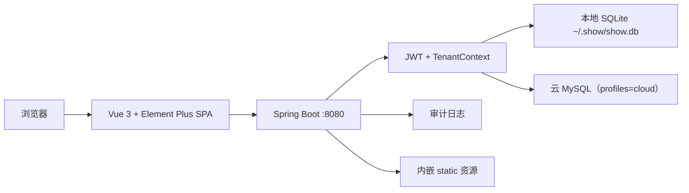

# Show · 理发店会员管理系统

> 面向中小理发店、社区店、夫妻店的轻量会员与收银工具。  
> **纯 Web 交付**：Spring Boot 内嵌前端，浏览器打开即可使用，无需桌面客户端。


---

## 为什么是它

- **客户二选一**：**本地买断**（SQLite 本机、无小程序）或 **SaaS 云版**（MySQL + 运营台 + 小程序）。
- **安全闭环**：JWT 鉴权 + 租户隔离 + 审计日志，业务接口默认需登录。
- **聚焦高频场景**：会员、充值、消费（校验码）、员工、服务、报表、审计。
- **现代 Web UI**：Vue 3 + Element Plus，浅色侧栏中后台布局，适配浏览器使用。

---

## 功能与页面对应

| 页面 | 路由 | 能力说明 |
|------|------|----------|
| **登录 / 注册** | `/#/login` | 店长登录；记住用户名；按注册策略展示注册入口（默认仅允许首个店长） |
| **经营总览** | `/#/app/dashboard` | 活跃会员、总余额、今日充值/消费；今日目标（本地记忆）；快捷入口；经营建议 |
| **会员管理** | `/#/app/customers` | 分页列表、搜索、新增/编辑（抽屉）、校验码显隐、停用/恢复、导出 CSV |
| **充值消费** | `/#/app/transactions` | 充值入账；消费扣款（员工+服务+金额联动默认价+校验码）；交易流水与按日期导出 |
| **员工管理** | `/#/app/employees` | 员工增改、在岗/停用、分页搜索 |
| **报表分析** | `/#/app/reports` | 日期区间汇总、服务分布、员工业绩、导出业绩 CSV |
| **审计日志** | `/#/app/audit` | 关键操作记录查询与分页浏览 |
| **服务项目** | `/#/app/settings` | 服务类型与默认价格 CRUD、启用/停用 |
| **使用帮助** | `/#/app/help` | 使用说明、本机/局域网访问地址提示 |

### 账号与安全

- 登录 / 注册（策略：`first-only` / `open` / `invite`，见 `application.yml`）
- 修改密码（用户下拉菜单）
- JWT 鉴权；除登录、注册、注册状态查询外接口需 Bearer Token
- 租户隔离：业务数据按 `tenant_id` 隔离

### 会员与收银

- 会员：姓名、手机号、4 位校验码（默认可取手机号后四位）、备注、初次充值
- 账户余额：`t_account` 维护，消费侧原子扣减，列表直接展示余额
- 消费：选择会员 / 员工 / 服务 → 金额按服务默认价联动（可改）→ 校验码校验后扣款
- 充值 / 交易流水分页；CSV 导出（浏览器下载）

### 统计与配置

- 经营总览 KPI 卡片
- 报表：充值/消费/净收入、服务分布条、员工业绩
- 服务项目默认价；注册后按租户初始化默认服务
- 审计日志可检索

### 后端扩展能力（接口已具备，部分 UI 未单独成页）

- 充值/消费冲正
- 数据备份与排队恢复（重启生效）
- 租户设置（如目标等，见 `/api/settings`）
- 在岗员工/服务 options 接口

更多开发说明见 [`docs/开发与运行.md`](./docs/开发与运行.md)。

---

## 截图展示


---

## 系统架构



| 层级 | 技术 | 说明 |
|------|------|------|
| 前端 | Vue 3.4、Vue Router、Vite 5、Element Plus 2 | Hash 路由；构建产物输出到后端 `static` |
| 后端 | Spring Boot 3.1.5、JDBC、JJWT | 默认端口 `8080` |
| 数据库 | **本地 SQLite** / **云 MySQL** | 默认文件库；`cloud` profile 用 MySQL |

---

## 数据模型（核心表）

| 表 | 说明 |
|----|------|
| `t_manager` | 店长账号 |
| `t_customer` | 会员（含 `verify_code`） |
| `t_account` | 会员余额 |
| `t_employee` | 员工 |
| `t_service_type` | 服务类型 |
| `t_recharge_record` | 充值记录 |
| `t_consume_record` | 消费记录 |
| `t_audit_log` | 审计日志 |

建表 / 迁移：Flyway · `src/main/resources/db/migration/sqlite|mysql/`。

密钥与配置：`~/.show/secrets.properties`（JWT 等，首次启动生成）。

---

## 依赖与版本

### 后端

- Java 17
- Spring Boot 3.1.5
- sqlite-jdbc 3.46.x
- JJWT 0.12.5

### 前端

- Node.js 18+（建议 LTS）
- Vue 3.4.x、Vue Router 4.3.x
- Vite 5.4.x、Element Plus 2.x、@element-plus/icons-vue

---

## 本地运行

### 环境

- JDK 17、Maven 3.8+、Node.js 18+

### 生产式（静态页由 jar 提供）

```powershell
cd frontend
npm install
npm run build
cd ..
mvn spring-boot:run
```

浏览器打开：**http://localhost:8080**

或使用一键脚本：

```powershell
.\scripts\compile_all.ps1
java -jar target\ddmo-1.0.0.jar
```

### 开发式（前端 HMR）

```powershell
# 终端 1
mvn spring-boot:run

# 终端 2
cd frontend
npm run dev
```

浏览器打开：**http://127.0.0.1:3000**（`/api` 代理到 8080）。

首次启动会自动创建 `~/.show/show.db` 与表结构。

---

## 一键构建

```powershell
.\scripts\compile_all.ps1
```

流程：

1. `frontend`：`npm install` + `npm run build` → `src/main/resources/static`
2. 仓库根：`mvn clean package -DskipTests`
3. 产物：`target\ddmo-1.0.0.jar`

运行：

```powershell
java -jar target\ddmo-1.0.0.jar
```

---

## 目录结构（简要）

```
show-standard/
├── frontend/                 # Vue 3 + Element Plus
│   └── src/
│       ├── views/            # 登录与各业务页
│       ├── layouts/          # 主布局（浅色侧栏）
│       ├── components/       # StatCard / MoneyText 等
│       └── api/              # 接口封装
├── src/main/java/com/ddmo/app/
│   ├── DdmoApplication.java  # 启动入口
│   ├── controller/           # REST
│   ├── service/
│   └── security/             # JWT、租户
├── src/main/resources/
│   ├── application.yml
│   ├── db/migration/sqlite|mysql/
│   └── static/               # 前端构建输出
├── docs/                     # 中文文档（见文末索引）
│   └── 截图/
└── scripts/                  # 构建 / 桌面打包脚本
    ├── compile_all.ps1
    └── package-desktop.bat
```


---

## 配置要点

| 配置 | 位置 | 说明 |
|------|------|------|
| 端口 | `server.port` | 默认 `8080` |
| C 端注册 | `app.register.mode` | 示例 `first-only` |
| C 端邀请码 | `app.register.invite-code` | 示例 `DEMO-CEND`（仅 invite 模式） |
| SaaS 运营 | `app.saas.bootstrap-*` | 示例 `platform` / `platform123` |
| SaaS 开店码 | `app.saas.invite-code` | 示例 `WELCOME` |
| JWT | `~/.show/secrets.properties` | 运行时密钥，勿提交仓库 |

现阶段配置写死在 `application.yml`，**不依赖环境变量**。

---

## 双系统：C 端门店 + SaaS 运营（隔离）

| | **C 端 Show** | **SaaS** |
|--|---------------|----------|
| 用途 | 门店会员收银 | 多租户开通、邀请码、停用、C 端数据只读汇总 |
| 代码 | `com.ddmo.app` + `frontend/` | `com.ddmo.saas` + `frontend-saas/` |
| API | `/api/**` | `/api/saas/**` |
| 入口 | `http://host:8080/` | `http://host:8080/saas/` |
| 数据库 | **同一库**；业务表仅 C 端写入，SaaS 可汇总/管控租户 |

```powershell
mvn spring-boot:run

# 构建两套前端
cd frontend ; npm run build ; cd ..
cd frontend-saas ; npm install ; npm run build ; cd ..
```

SaaS 登录示例：`platform` / `platform123`。开发时 C 端 HMR `:3000`，SaaS HMR `:3001`。

### 文档索引（`docs/`）

| 文档 | 说明 |
|------|------|
| **[项目完整运行手册.md](./docs/项目完整运行手册.md)** | **客户端 / SaaS / 小程序完整安装与运行（推荐先读）** |
| [开发与运行.md](./docs/开发与运行.md) | 本机开发、构建 |
| [产品双轨说明.md](./docs/产品双轨说明.md) | 本地版 / 云版原则 |
| [实现进度.md](./docs/实现进度.md) | 功能勾选总表 |
| [项目风险与改进.md](./docs/项目风险与改进.md) | 风险清单与 P0 改进 |
| [SaaS运营平台.md](./docs/SaaS运营平台.md) | 运营台隔离与分层 |
| [商家小程序.md](./docs/商家小程序.md) | 商家微信小程序（工程：`miniprogram-biz/`） |
| [云版Docker部署.md](./docs/云版Docker部署.md) | Docker Compose |
| [桌面客户端打包.md](./docs/桌面客户端打包.md) | Windows 安装包 |

## 后续演进（可选）

- 会员微信小程序（后置，见商家小程序文档）
- ~~多角色（店长 / 店员）与菜单权限~~（已实现）
- 会员标签、回访与沉睡唤醒
- 次卡 / 套餐 / 积分
- 交班对账、日结
- 在线订阅支付

---

## License

MIT
